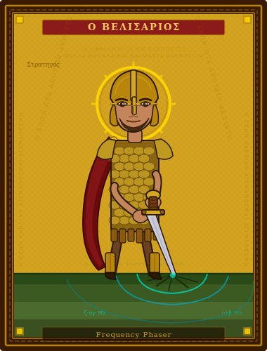

# Frequency Phaser

<p align="center">
  
</p>

<p align="center">
  <em>A terminal-based multi-oscillator frequency generator.<br/>
  Schumann resonances, healing tones, brainwave entrainment, chords — all from your keyboard.</em>
</p>

---

## Features

### Multi-Oscillator Engine
- Up to **8 simultaneous oscillators**, each independently tunable
- Per-oscillator **frequency** (0.01 Hz – 96 kHz), **amplitude**, **waveform**, and **stereo channel routing** (L / R / L+R)
- Lock-free audio thread — no mutexes on the hot path

### Waveforms
| Symbol | Name | Description |
|--------|------|-------------|
| `∿` | Sine | Pure tone |
| `⊓` | Square | Odd harmonics, hollow |
| `⋀` | Triangle | Softer odd harmonics |
| `⟋` | Sawtooth | Full harmonic series, bright |
| `≋` | Pink Noise | 1/f broadband noise |

### Filters
| Filter | Description |
|--------|-------------|
| `None` | Raw waveform |
| `Orchestral` | Additive harmonics + ensemble detuning + 5.5 Hz vibrato + bow noise |

### Preset Library (67+ presets)
| Category | Examples |
|----------|---------|
| **Schumann** | 7.83 Hz, 14.3 Hz, 20.8 Hz, 27.3 Hz, 33.8 Hz |
| **Brainwave** | Delta (0.5–4 Hz), Theta, Alpha, Beta, Gamma |
| **Solfeggio** | 174, 285, 396, 417, 528, 639, 741, 852, 963 Hz |
| **Chakra (Traditional)** | Root 256 Hz → Crown 963 Hz |
| **Chakra (Vedic)** | Root 194.18 Hz → Crown 172.06 Hz |
| **Musical** | A432, A444, Concert A440, C256, Middle C |
| **Healing** | Tibetan 432, Earth Resonance, Golden Ratio |
| **Geotechnical** | Seismic P-wave, S-wave, Rayleigh, Love wave, micro-tremor, soil resonance… |
| **Reference** | 1 Hz, 10 Hz, 100 Hz, 1 kHz, 10 kHz, 20 kHz, sub-bass, infrasound |

### Polyphonic Mode
Layer up to 8 voices as a **chord or scale**, rooted at any frequency:
- **12 chord types**: Power, Major, Minor, Diminished, Augmented, Major 7th, Minor 7th, Dominant 7th, Sus2, Sus4, Add9, Major 9th
- **11 scale types**: Major, Natural Minor, Harmonic Minor, Pentatonic Maj/Min, Blues, Dorian, Phrygian, Lydian, Mixolydian, Chromatic
- **3 voicings**: Close · Open · Wide
- Preset cycling moves the **entire chord** in relative frequency — perfect for harmonic exploration

---

## Controls

### Normal Mode

| Key | Action |
|-----|--------|
| `Enter` | Play / Stop |
| `← →` | Adjust frequency (current step size) |
| `Shift + ← →` | Coarse frequency adjust |
| `Page Up / Down` | Decade jump (×10 / ÷10) |
| `↑ ↓` | Oscillator volume ±5% |
| `+ / -` | Master volume ±5% |
| `Tab / Shift+Tab` | Cycle active oscillator |
| `W` | Next waveform |
| `F` | Cycle filter (None → Orchestral → …) |
| `S` | Cycle step mode (Fine / Medium / Coarse) |
| `E` | Enable / disable active oscillator |
| `Y` | Enable polyphonic mode + open Poly Panel |
| `P` | Preset browser (stopped) / cycle presets (playing) |
| `F1` | Add oscillator |
| `F2` | Remove active oscillator |
| `0–9 .` | Begin direct frequency entry |
| `Q` | Quit |

### Direct Frequency Entry

Start typing any digit or `.` to enter a frequency in Hz directly. Press `Enter` to apply, `Esc` to cancel.

### Preset Browser

| Key | Action |
|-----|--------|
| `↑ ↓` / `j k` | Navigate presets |
| `Enter` | Apply preset |
| `Esc` / `P` | Close browser |

### Poly Panel (`Y`)

| Key | Action |
|-----|--------|
| `Enter` | Play / Stop |
| `← →` | Shift root note by semitone |
| `Shift + ← →` | Shift root note by octave |
| `↑ ↓` | Previous / next chord or scale type |
| `Tab` | Toggle Chord ↔ Scale mode |
| `V` | Cycle voicing (Close → Open → Wide) |
| `P` | Open preset browser (returns to Poly Panel) |
| `Y` | Turn polyphony off |
| `Esc` | Return to Normal mode (poly stays on) |

---

## Building

```bash
# Prerequisites: Rust 1.70+ and a working audio output device

cargo build --release
cargo run --release
```

Audio is non-fatal — the UI works without a sound card (useful for frequency planning).

### Dependencies
- [`cpal 0.15`](https://crates.io/crates/cpal) — cross-platform audio (WASAPI / CoreAudio / ALSA)
- [`ratatui 0.29`](https://crates.io/crates/ratatui) — terminal UI
- [`crossterm 0.28`](https://crates.io/crates/crossterm) — terminal events
- [`anyhow 1`](https://crates.io/crates/anyhow) — error handling

---

## Architecture

```
main.rs
├── audio/
│   ├── engine.rs       # cpal stream setup, audio callback
│   └── generator.rs    # Oscillator, OrchestrialState, PinkNoiseGen, OscillatorRt
├── state.rs            # Lock-free shared state (AtomicU64/U32/Bool)
├── music.rs            # Chord/scale theory, PolyConfig, MIDI ↔ Hz helpers
├── presets.rs          # 67+ frequency presets
└── ui/
    ├── app.rs          # Event handling, InputMode state machine
    └── render.rs       # ratatui layout, circular dial, poly panel, preset sidebar
```

All oscillator parameters (frequency, amplitude, waveform, filter, channel, enable) are stored as atomics shared between the UI thread and the audio callback — no locking required on the hot path.

---

## License

GNU General Public License v3.0 — see [LICENSE](LICENSE) for the full text.

This program is free software: you can redistribute it and/or modify it under the terms of the GNU GPL as published by the Free Software Foundation, either version 3 of the License, or (at your option) any later version.
