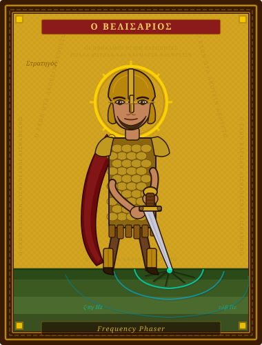
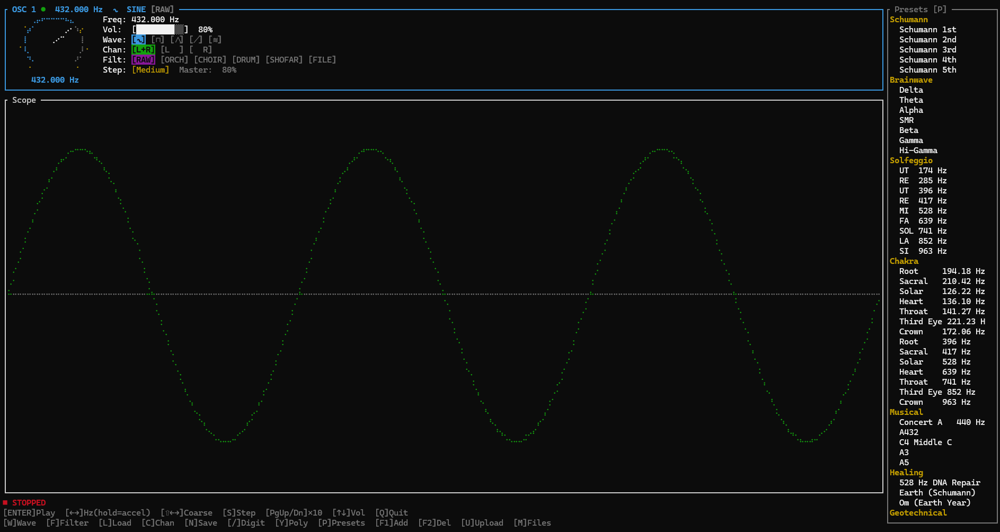
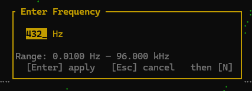
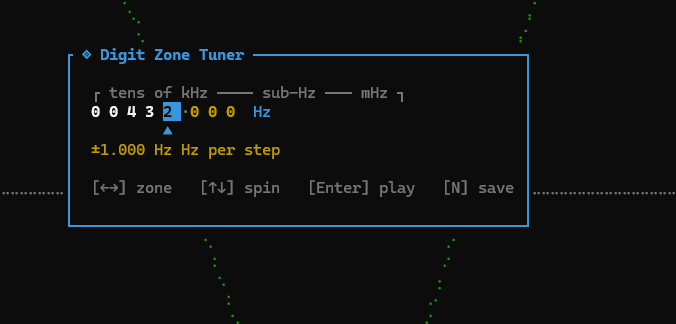
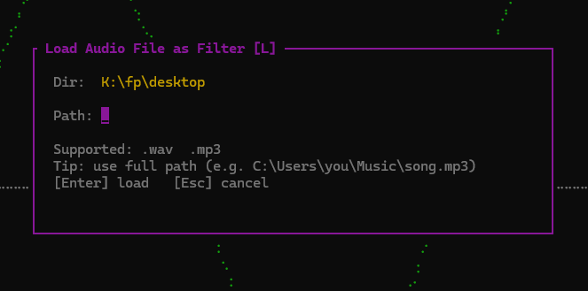
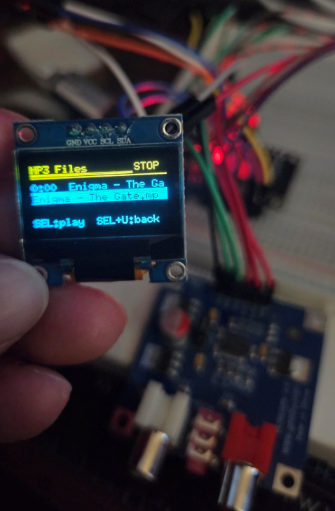
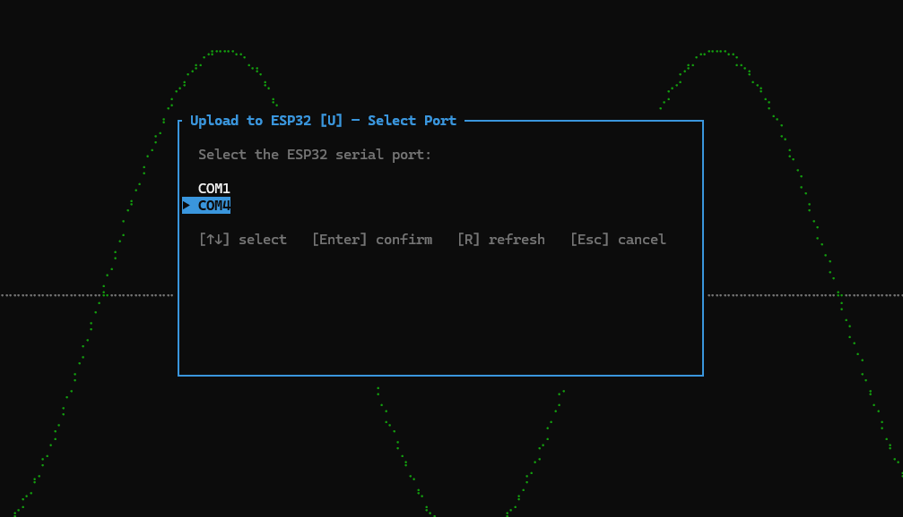
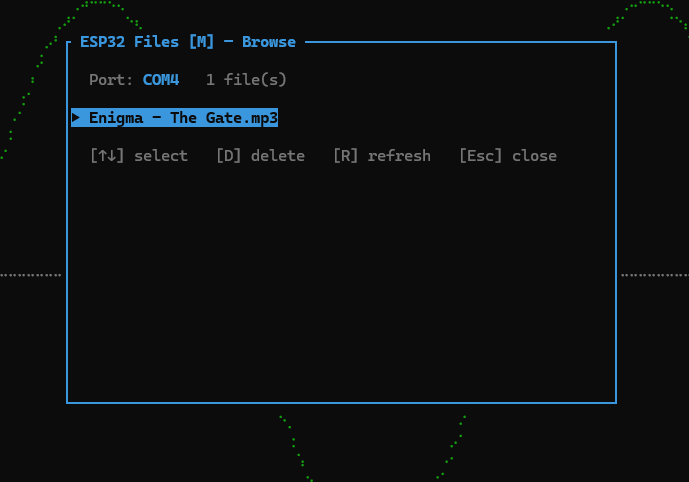

# Frequency Phaser

<p align="center">
  
</p>

<p align="center">
  <em>A multi-oscillator frequency generator — available as a cross-platform terminal app and as standalone ESP32 hardware.</em>
</p>

<p align="center">
  <a href="http://buymeacoffee.com/sormondocom">
    
  </a>
</p>

---

> *"In theory, if you load a Taylor Swift MP3 and tune the resonance dial to the Schumann frequency,
> you could drill through stone. We accept no liability for geological incidents."*

---

## Project Structure

```
fp/
├── core/           # Shared oscillator engine (no_std compatible)
├── desktop/        # Terminal TUI app (Windows / macOS / Linux)
└── esp32-fw/       # ESP-WROOM-32 standalone hardware firmware
```

`core` is a library shared by both targets — the same oscillator math runs on your laptop and on the microcontroller.

---

## Desktop App

A full-featured terminal UI built with [ratatui](https://crates.io/crates/ratatui). Runs anywhere Rust does.



### Capabilities

**Multi-Oscillator Engine**
- Up to **8 simultaneous oscillators**, each independently tunable
- Per-oscillator **frequency** (0.01 Hz – 96 kHz), **amplitude**, **waveform**, and **stereo channel routing** (L / R / L+R)
- Lock-free audio thread — no mutexes on the hot path
- Audio is non-fatal — the UI works without a sound card (useful for frequency planning)

**Waveforms**
| Symbol | Name | Description |
|--------|------|-------------|
| `∿` | Sine | Pure tone |
| `⊓` | Square | Odd harmonics, hollow |
| `⋀` | Triangle | Softer odd harmonics |
| `⟋` | Sawtooth | Full harmonic series, bright |
| `≋` | Pink Noise | 1/f broadband noise |

**Filters**
| Filter | Description |
|--------|-------------|
| `None` | Raw waveform |
| `Orchestral` | Additive harmonics + ensemble detuning + 5.5 Hz vibrato + bow noise |

**Preset Library (67+ presets)**
| Category | Examples |
|----------|---------|
| **Schumann** | 7.83 Hz, 14.3 Hz, 20.8 Hz, 27.3 Hz, 33.8 Hz |
| **Brainwave** | Delta (0.5–4 Hz), Theta, Alpha, Beta, Gamma |
| **Solfeggio** | 174, 285, 396, 417, 528, 639, 741, 852, 963 Hz |
| **Chakra (Traditional)** | Root 256 Hz → Crown 963 Hz |
| **Chakra (Vedic)** | Root 194.18 Hz → Crown 172.06 Hz |
| **Musical** | A432, A444, Concert A440, C256, Middle C |
| **Healing** | Tibetan 432, Earth Resonance, Golden Ratio |
| **Geotechnical** | Seismic P-wave, S-wave, Rayleigh, Love wave, micro-tremor, soil resonance |
| **Reference** | 1 Hz, 10 Hz, 100 Hz, 1 kHz, 10 kHz, 20 kHz, sub-bass, infrasound |

**Polyphonic Mode**
Layer up to 8 voices as a chord or scale rooted at any frequency:
- **12 chord types**: Power, Major, Minor, Diminished, Augmented, Major 7th, Minor 7th, Dominant 7th, Sus2, Sus4, Add9, Major 9th
- **11 scale types**: Major, Natural Minor, Harmonic Minor, Pentatonic Maj/Min, Blues, Dorian, Phrygian, Lydian, Mixolydian, Chromatic
- **3 voicings**: Close · Open · Wide

### Controls

**Normal Mode**

| Key | Action |
|-----|--------|
| `Enter` | Play / Stop |
| `← →` | Adjust frequency (current step size) |
| `Shift + ← →` | Coarse frequency adjust |
| `Page Up / Down` | Decade jump (×10 / ÷10) |
| `↑ ↓` | Oscillator volume ±5% |
| `+ / -` | Master volume ±5% |
| `Tab / Shift+Tab` | Cycle active oscillator |
| `W` | Next waveform |
| `F` | Cycle filter |
| `L` | Load WAV/MP3 as custom file filter |
| `U` | Upload MP3/WAV to ESP32 via serial (UART transfer) |
| `M` | Open ESP32 file manager (list and delete files on device) |
| `S` | Cycle step mode (Fine / Medium / Coarse) |
| `E` | Enable / disable active oscillator |
| `Y` | Enable polyphonic mode + open Poly Panel |
| `P` | Preset browser (stopped) / cycle presets (playing) |
| `F1` | Add oscillator |
| `F2` | Remove active oscillator |
| `0–9 .` | Open direct frequency entry — type a value and press `Enter` to apply |
| `/` | Open Digit Zone Tuner — edit the frequency one digit at a time |
| `Q` | Quit |

**Direct frequency entry (`0–9 .`)**



Type any value from 0.0100 Hz to 96.000 kHz and press `Enter` to apply. `Esc` cancels.

**Digit Zone Tuner (`/`)**



Lets you nudge a single digit of the frequency up or down without retyping the whole value. `←` `→` moves between digit positions; `↑` `↓` spins the selected digit; `Enter` begins playback; `N` saves the frequency.

**Loading an audio file as a filter (`L`)**



Loads a WAV or MP3 from disk and applies it as a convolution filter on the active oscillator. Enter the full path to the file and press `Enter`.

> **Paths with spaces:** wrap the path in double quotes — e.g. `"C:\Users\you\Music\my song.mp3"` — so the entire path is captured as a single argument.

**Poly Panel (`Y`)**

| Key | Action |
|-----|--------|
| `Enter` | Play / Stop |
| `← →` | Shift root note by semitone |
| `Shift + ← →` | Shift root note by octave |
| `↑ ↓` | Previous / next chord or scale type |
| `Tab` | Toggle Chord ↔ Scale mode |
| `V` | Cycle voicing (Close → Open → Wide) |
| `Y` | Turn polyphony off |

**ESP32 File Manager (`M`)**

Opens a popup overlay that talks to the connected ESP32 over serial.

| Key | Action |
|-----|--------|
| `↑ ↓` | Select port / navigate file list |
| `Enter` | Connect to device / confirm action |
| `D` | Delete selected file |
| `Y` | Confirm delete |
| `N / Esc` | Cancel / close |

### Building the Desktop App

```bash
# Prerequisites: Rust stable (1.70+), working audio output device

# From the workspace root:
cargo build --release
cargo run --release

# Or from the desktop/ subdirectory:
cd desktop
cargo run --release
```

**Runtime dependencies:** [`cpal`](https://crates.io/crates/cpal) (WASAPI / CoreAudio / ALSA), [`ratatui`](https://crates.io/crates/ratatui), [`crossterm`](https://crates.io/crates/crossterm), [`symphonia`](https://crates.io/crates/symphonia) (WAV/MP3 file playback), [`serialport`](https://crates.io/crates/serialport) (ESP32 communication)

---

## ESP32 Hardware

The same oscillator core runs on an **ESP-WROOM-32**, producing audio via I2S and presenting a 7-button UI on an OLED display — no computer required. MP3 and WAV files stored on the device's flash can be played back directly through the DAC.



*(She may not be pretty, but she works.  Get out there and build another version.  Make things better!)*

### Hardware

| Component | Part | Notes |
|-----------|------|-------|
| MCU | ESP-WROOM-32 | Any ESP32 DevKit works |
| DAC | PCM5102A | I2S; FMT → GND, XSMT → 3.3V, SCK → GND |
| Display | SSD1306 128×64 OLED | I2C at 0x3C; VCC must be 5V |
| Navigation | 7 × tactile buttons | Active-low, internal pull-ups enabled |

### Wiring

```
  ESP-WROOM-32 DevKit
  ┌────────────┐
  │            │                    ┌─────────────────────────┐
  │    GPIO 25 ├─ DIN  ───────────► │                         │
  │    GPIO 26 ├─ LRCK ───────────► │  PCM5102A  (I2S DAC)   │ ──► Audio Out
  │    GPIO 27 ├─ BCK  ───────────► │                         │
  │       3.3V ├─ XSMT ───────────► │  FMT → GND, SCK → GND  │
  │            │                    └─────────────────────────┘
  │            │
  │    GPIO 21 ├─ SDA ────────────► ┌─────────────────────────┐
  │    GPIO 22 ├─ SCL ────────────► │  SSD1306 OLED  (I2C)    │
  │         5V ├─ VCC ────────────► │  128×64  ⚠ 5V only      │
  │            │                    └─────────────────────────┘
  │            │
  │    GPIO  4 ├───── [VOL+  ] ─┐
  │    GPIO  5 ├───── [VOL-  ]  │
  │    GPIO 18 ├───── [LEFT  ]  ├─ other leg → GND
  │    GPIO 19 ├───── [RIGHT ]  │  (internal pull-ups enabled)
  │    GPIO 23 ├───── [SELECT]  │
  │    GPIO 32 ├───── [UP    ]  │
  │    GPIO 33 ├───── [DOWN  ] ─┘
  │            │
  └────────────┘
```

> **Note on microSD expansion:** A SPI microSD adapter can supplement or replace SPIFFS for larger storage. Suggested wiring: MOSI → GPIO 13, CLK → GPIO 14, CS → GPIO 15, MISO → GPIO 34 (input-only pin). Avoid GPIO 12 (bootstrap strapping pin).

### OLED Display

The display has several layouts depending on mode:

**Normal mode** — preset browser

```
┌─────────────────────────────┐  ← yellow strip
│ 7.83 Hz               STOP  │
├─────────────────────────────┤
│ Schumann                    │  category
│ Schumann 7.83 Hz            │  preset name
│ SINE RAW [1/67]             │  waveform · filter · index
│ U/D:prst  L/R:+/-Hz         │  hint
└─────────────────────────────┘
```

**Tuning mode** — entered by pressing LEFT or RIGHT

```
┌─────────────────────────────┐  ← yellow strip (frequency updates live)
│ 8.50 Hz               PLAY  │
├─────────────────────────────┤
│  ∿∿∿∿∿∿∿∿∿∿∿∿∿∿∿∿∿∿∿∿∿∿∿  │
│ ∿                         ∿ │  waveform graphic (one cycle, full width)
│   ∿∿∿∿∿∿∿∿∿∿∿∿∿∿∿∿∿∿∿∿∿   │
│ SINE / RAW                  │  waveform · filter
│ L/R:Hz   U/D:preset         │  hint (shows L/R:1Hz in fine step mode)
└─────────────────────────────┘
```

**MP3 file browser** — opened with SELECT + DOWN simultaneously

```
┌─────────────────────────────┐  ← yellow strip
│ MP3 Files             STOP  │  volume bar · progress dot
├─────────────────────────────┤
│ 0:42  My Long Song Na…      │  elapsed timer · scrolling filename
│ ▌My Long Song Name.mp3 ▐    │  selected file (inverted, scrolls if long)
│ another_track.mp3           │
│ SEL:play  SEL+U:back        │  hint
└─────────────────────────────┘
```

The yellow strip shows a volume bar and, during playback, a sparse dotted track with a solid 3-pixel dot marking the current position in the song. Long filenames scroll right automatically, pause at each end, then loop.

**USB transfer screen** — shown automatically while a file transfer is in progress

```
┌─────────────────────────────┐  ← yellow strip
│ USB TRANSFER                │
├─────────────────────────────┤
│ Receiving file...           │
│ [████████████░░░░░░░░░░░░]  │  progress bar
│  67%  68432/102400 B        │
│ Do not disconnect           │
└─────────────────────────────┘
```

### Controls

**Always available**

| Button | Action |
|--------|--------|
| SELECT | Toggle play / stop |
| VOL+   | Volume up 5% (max 100%) |
| VOL-   | Volume down 5% (min 0%) |

**Normal mode** — preset browser

| Button | Action |
|--------|--------|
| UP     | Next preset |
| DOWN   | Previous preset |
| LEFT / RIGHT | Enter tuning mode (frequency down / up) |

**Tuning mode** — entered on the first LEFT or RIGHT press

The frequency starts at the current preset's value. UP or DOWN exits tuning and returns to preset browsing.

| Button | Action |
|--------|--------|
| LEFT  | Frequency down |
| RIGHT | Frequency up   |
| UP    | Previous preset (exits tuning) |
| DOWN  | Next preset (exits tuning) |

**Step size** scales automatically with the current frequency:

| Range | Step |
|-------|------|
| < 1 Hz | 0.01 Hz |
| 1 – 10 Hz | 0.1 Hz |
| 10 – 100 Hz | 1 Hz |
| 100 Hz – 1 kHz | 5 Hz |
| > 1 kHz | 50 Hz |

**Hold-to-repeat** — holding LEFT or RIGHT repeats after 400 ms and accelerates:

| Hold duration | Rate |
|---------------|------|
| 0.4 – 1 s | 20 steps / sec |
| 1 – 2 s   | 40 steps / sec |
| 2 s+      | 80 steps / sec |

**Two-button gestures** (LEFT + RIGHT together):

| Gesture | Action |
|---------|--------|
| Both pressed within 100 ms of each other | Round frequency to nearest whole Hz |
| Hold one, then press the other (> 100 ms apart) | Toggle **fine step mode** — step locked to 1 Hz. Display hint changes to `L/R:1Hz`. Same gesture toggles it back off. |

**MP3 file browser** — opened with SELECT + DOWN simultaneously

| Gesture | Action |
|---------|--------|
| SELECT + DOWN (simultaneous) | Open MP3 browser |
| SELECT + UP   (simultaneous) | Return to normal mode |
| UP / DOWN | Navigate file list |
| SELECT | Play / stop selected file |

### Uploading and Managing Audio Files

You can transfer MP3 or WAV files from the desktop app to the ESP32's internal flash (SPIFFS filesystem) over the same USB cable used for programming.

**Capacity:** The custom partition table allocates **2.75 MB** to SPIFFS, enough for one or two short audio clips (e.g. a 1-minute 128 kbps MP3 ≈ 960 KB).

**Transfer rate:** ~11 KB/s at 115 200 baud — 1 MB takes about 90 seconds.

**Upload workflow:**

1. Flash the firmware as normal: `cargo run --release` (opens the serial monitor)
2. **Close the serial monitor** — the port must not be held open by any other program
3. In the **desktop app**, press **`U`** to open the upload screen
4. Select the ESP32 serial port (e.g. `COM4`) with `↑ ↓`, then `Enter`



5. Type the full path to your MP3 or WAV file, then `Enter`
   > **Paths with spaces:** wrap the path in double quotes — e.g. `"C:\Music\my song.mp3"`
6. The desktop shows a progress bar; the **ESP32 OLED switches to the USB transfer screen** automatically
7. Wait for the progress bar to reach 100% — the overlay stays open so you can confirm success, then press `Esc` to close

**Managing files on the device:**

Press **`M`** in the desktop app to open the file manager. It connects to the ESP32, lists the files currently stored on SPIFFS, and lets you delete individual files. This is useful for freeing space before uploading a new file.



Filenames — including spaces — are preserved exactly as they appear on disk. The only characters stripped from filenames are those that are unsafe at the VFS level: control characters and path separators.

### MP3 Playback

Audio files stored on SPIFFS are decoded on the ESP32 in real time using a minimal MP3 decoder ([minimp3](https://github.com/lieff/minimp3) via `minimp3-sys`). Decoded PCM is streamed to the PCM5102A DAC over I2S at 44 100 Hz stereo.

- Song duration is estimated from the first decoded frame's bitrate and the file size; the OLED progress dot updates live throughout playback
- Mono MP3s are upmixed to stereo automatically
- Volume is applied in software before the I2S write

---

## Building the Firmware

### Quick Start

```powershell
# 1. Install the Espressif Rust toolchain (one-time)
cargo install espup
espup install

# 2. Build and flash
cd esp32-fw
cargo run --release
```

> **First build only:** ESP-IDF v5.2.5 (~3 GB) is downloaded and compiled automatically. Expect 20–40 minutes. Subsequent builds are incremental and typically take under a minute.

**Flashing note:** If `espflash` fails to connect, hold the **BOOT** button on the ESP32, run `cargo run --release`, and release BOOT once `Connecting...` appears.

---

## Firmware Build Toolchain — Deep Dive

This section documents every layer of the build system so the project can be ported to other machines or adapted for other ESP32 projects.

### Why a Custom Rust Toolchain?

The ESP32 uses an **Xtensa LX6** CPU. Xtensa is not included in upstream LLVM or in the official Rust distribution. Espressif maintains a fork of both:

- [espressif/llvm-project](https://github.com/espressif/llvm-project) — LLVM with Xtensa backend
- [esp-rs/rust](https://github.com/esp-rs/rust) — Rust compiler built against that LLVM

This fork is distributed as the **`esp` toolchain channel**, installed by `espup` and pinned in `esp32-fw/rust-toolchain.toml`:

```toml
[toolchain]
channel = "esp"
```

`rustup` treats `esp` like any other toolchain channel. After `espup install` the compiler lives alongside stable/nightly in `~/.rustup/toolchains/esp-*/`.

`espup` also installs:
- The Xtensa GCC cross-compiler (`xtensa-esp-elf-gcc`) — used as the linker back-end
- `ldproxy` — the linker proxy (explained below)
- `espflash` — the flashing tool

### The Target Triple: `xtensa-esp32-espidf`

The build target is set in `esp32-fw/.cargo/config.toml`:

```toml
[build]
target = "xtensa-esp32-espidf"
```

This triple encodes three things:

| Part | Meaning |
|------|---------|
| `xtensa` | CPU architecture |
| `esp32` | Chip variant (LX6 core, specific peripherals) |
| `espidf` | OS/environment: backed by ESP-IDF's POSIX layer |

The `-espidf` suffix distinguishes this from `xtensa-esp32-none-elf` (bare-metal, no OS). With the `-espidf` target Rust's standard library is available — threads, heap allocation, file I/O via SPIFFS — because ESP-IDF provides the underlying libc.

This is a **custom target** not included in the official Rust distribution, which has two consequences:

1. The standard library must be compiled from source (see `build-std` below)
2. The target specification JSON is bundled inside the `esp` toolchain

### `build-std` — Compiling std from Source

Because `xtensa-esp32-espidf` has no prebuilt std artifacts, the project opts in to building std as part of every workspace build:

```toml
[unstable]
build-std = ["std", "panic_abort"]
```

`panic_abort` is included instead of the default `panic_unwind` because unwinding through Xtensa frames is expensive and unnecessary on an embedded device.

This is an unstable Cargo feature, hence the `[unstable]` table. It requires the nightly or fork toolchain — the `esp` channel satisfies this.

**What gets compiled:** Cargo fetches the `rust-src` component for the `esp` toolchain and builds `core → alloc → std → panic_abort` targeted at `xtensa-esp32-espidf`. The result is cached in the target directory and reused on subsequent builds unless the toolchain or target changes.

### `build.rs` and `embuild` — ESP-IDF Integration

The firmware's `build.rs` is a single line:

```rust
fn main() {
    embuild::espidf::sysenv::output();
}
```

[`embuild`](https://github.com/esp-rs/embuild) is an Espressif crate that does the heavy lifting of connecting ESP-IDF's CMake build system to Cargo's build script protocol. Here is what happens on the **first build**:

1. `embuild` reads `ESP_IDF_VERSION = "v5.2.5"` from the environment (set in `.cargo/config.toml`) and checks whether that version already exists in the local cache at `esp32-fw/.embuild/espressif/esp-idf/v5.2.5/`
2. If not present, it clones the ESP-IDF repository at the specified tag
3. It runs `esp-idf/install.py` which creates a Python virtual environment and downloads the ESP-IDF tool bundle into `esp32-fw/.embuild/espressif/tools/`:
   - `xtensa-esp-elf/` — the Xtensa GCC cross-toolchain
   - `cmake/` and `ninja/` — the C build system
   - `openocd-esp32/` — JTAG debugger (not used directly but part of the bundle)
4. It runs CMake to configure the ESP-IDF component build, then `ninja` to compile the selected C components into static libraries (`.a` files): FreeRTOS, lwIP networking stack, SPIFFS filesystem, UART driver, I2S driver, SSD1306 support headers, etc.
5. It emits Cargo `cargo:rustc-link-*` directives that tell the Rust linker where to find these libraries and which to link

On **subsequent builds** only steps 4 and 5 are repeated, and CMake/ninja are incremental — so usually nothing is recompiled.

The `ESP_IDF_VERSION` pin is important. Without it `embuild` defaults to v4.4.6, which is incompatible with the versions of `esp-idf-hal`, `esp-idf-svc`, and `esp-idf-sys` used here (all require 5.x).

### `esp-idf-sys`, `esp-idf-hal`, `esp-idf-svc` — The Rust Bindings

| Crate | Role |
|-------|------|
| `esp-idf-sys` | Raw `unsafe` FFI bindings generated from ESP-IDF C headers. Also contains the `build.rs` CMake driver that calls into `embuild`. |
| `esp-idf-hal` | Safe, idiomatic Rust wrappers around `esp-idf-sys` for peripherals (I2S, I2C, GPIO, etc.) |
| `esp-idf-svc` | Higher-level services (Wi-Fi, logging, NVS) built on `esp-idf-hal` |

These three crates must be kept in lock-step with each other and with the ESP-IDF version. The versions used:

| Crate | Version | ESP-IDF |
|-------|---------|---------|
| `esp-idf-sys` | 0.37 | 5.2.x |
| `esp-idf-hal` | 0.46 | 5.2.x |
| `esp-idf-svc` | 0.52 | 5.2.x |

### `ldproxy` — The Linker Proxy

The target entry in `.cargo/config.toml` sets:

```toml
[target.xtensa-esp32-espidf]
linker = "ldproxy"
```

`ldproxy` is an Espressif tool that acts as a shim between Rust's linker invocation style and the Xtensa GCC linker. When Cargo calls the linker, it passes arguments in a format GCC understands; `ldproxy` forwards them to `xtensa-esp32-elf-ld` (which lives in the embuild toolchain cache) along with the ESP-IDF link scripts that define the ESP32's memory map (IRAM, DRAM, DROM, RTC memory regions).

Without `ldproxy` the final link step would fail because the standard Rust linker invocation does not include ESP-IDF's custom linker scripts.

### `CC_xtensa_esp32_espidf` and `AR_xtensa_esp32_espidf`

`minimp3-sys` uses the [`cc`](https://crates.io/crates/cc) crate to compile its C source (`minimp3.h` as a unity build) during `cargo build`. The `cc` crate determines which C compiler to invoke by checking environment variables of the form `CC_<target>` and `AR_<target>`.

```toml
[env]
CC_xtensa_esp32_espidf = "K:/fp/esp32-fw/.embuild/espressif/tools/xtensa-esp-elf/esp-13.2.0_20230928/xtensa-esp-elf/bin/xtensa-esp32-elf-gcc.exe"
AR_xtensa_esp32_espidf = "K:/fp/esp32-fw/.embuild/espressif/tools/xtensa-esp-elf/esp-13.2.0_20230928/xtensa-esp-elf/bin/xtensa-esp32-elf-ar.exe"
```

Two details matter here:

**`xtensa-esp32-elf-gcc` vs `xtensa-esp-elf-gcc`:** The `espup`-installed `xtensa-esp-elf-gcc` (the generic Xtensa toolchain) defaults to **big-endian** output. The ESP32 is **little-endian**. The ESP32-specific `xtensa-esp32-elf-gcc` variant — downloaded by `embuild` into the cache — is pre-configured for the correct ABI. Using the wrong compiler produces an object file that links but produces garbage output.

**Absolute path:** These tools are not on PATH by default. The path points into `.embuild/espressif/tools/` where `embuild` cached the toolchain. If the toolchain version changes (because `ESP_IDF_VERSION` is bumped), the version segment in the path changes and these variables must be updated to match.

### `espidf_time64` Rustflag

```toml
rustflags = ["--cfg", "espidf_time64"]
```

ESP-IDF 5.x widened `time_t` from 32-bit to 64-bit on 32-bit platforms for Y2038 compliance. The Rust `std` for the `xtensa-esp32-espidf` target uses this cfg flag to match its `time_t` representation to the C side. Without it, any call into ESP-IDF that touches time (logging timestamps, `sleep`, etc.) would silently pass 32-bit values through a 64-bit ABI, corrupting the stack.

### `espflash` — The Runner and Flasher

```toml
runner = "espflash flash --chip esp32 --baud 115200 --partition-table K:/fp/esp32-fw/partitions.csv --monitor"
```

`cargo run` compiles the firmware ELF and then invokes this runner. `espflash` implements the **ESP32 ROM serial bootloader protocol**:

1. Toggles DTR/RTS on the USB-serial adapter to trigger the ESP32's auto-reset circuit, putting it into download mode (BOOT pin held low through the hardware reset)
2. Negotiates the highest supported flash baud rate (often 921 600 or higher, regardless of `--baud`)
3. Erases the affected flash sectors
4. Writes the compiled ELF as binary blobs to their partition offsets
5. Resets the chip and opens a serial monitor

`--baud 115200` controls only the **monitor baud rate** after flashing — not the flash speed, which is negotiated automatically. `--monitor` keeps the terminal open so log output is visible immediately after boot.

`--partition-table` must be an **absolute path**. The runner is invoked from the Cargo target directory, not the package root, so relative paths resolve incorrectly.

### The Partition Table

`esp32-fw/partitions.csv` defines the flash layout for the ESP32's 4 MB chip:

```
# Name,     Type, SubType,  Offset,   Size
nvs,        data, nvs,      0x9000,   0x5000    #  20 KB — Non-volatile storage (Wi-Fi, etc.)
phy_init,   data, phy,      0xE000,   0x1000    #   4 KB — RF calibration data
factory,    app,  factory,  0x10000,  0x140000  # 1.25 MB — firmware image
spiffs,     data, spiffs,   0x150000, 0x2B0000  # 2.75 MB — audio file storage
```

The default ESP-IDF partition table gives the factory app nearly the full 4 MB, leaving no room for user data. This custom table shrinks the firmware partition to 1.25 MB (the compiled release image is currently ~900 KB with room to grow) and gives SPIFFS 2.75 MB for audio files.

The partition table is written to flash at offset `0x8000`. `espflash` compares the on-device table against the CSV before each flash; if they already match it skips writing that region.

**First boot after a partition table change:** SPIFFS logs `mount failed, -10025. formatting...` — this is expected. The filesystem is being initialised on blank flash and will mount silently on every subsequent boot.

### Porting to Another Machine

**Linux / macOS:**
- `espup install` works identically; no `.exe` extensions
- The embuild toolchain cache lands under the project's `.embuild/` directory regardless of platform
- Update `CC_xtensa_esp32_espidf` and `AR_xtensa_esp32_espidf` in `.cargo/config.toml` to match the cached GCC path (same structure, no `.exe`)
- The `target-dir` shortening (`K:\\fp\\esp32-fw\\t`) is Windows-specific; remove it on Linux/macOS

**Windows path constraints:**
- `esp-idf-sys` enforces an 88-character limit on Cargo's `OUT_DIR` path (a restriction of the ESP-IDF CMake scripts, which use Windows API paths internally)
- Keep the project at a short root path (e.g. `K:\fp`)
- Move `CARGO_HOME` and `RUSTUP_HOME` to short paths (e.g. `K:\rust`, `K:\rustup`)
- The `target-dir = "K:\\fp\\esp32-fw\\t"` setting in `.cargo/config.toml` keeps the build output path short
- Windows `subst` does **not** help — embuild resolves real paths via `GetFinalPathNameByHandle`

**Changing the ESP-IDF version:**
1. Update `ESP_IDF_VERSION` in `.cargo/config.toml`
2. Update the `esp-idf-sys` / `esp-idf-hal` / `esp-idf-svc` versions in `Cargo.toml` to a matching set
3. Delete `.embuild/espressif/esp-idf/<old-version>/` (or let the new version download alongside the old one)
4. Update the version segment in the `CC_xtensa_esp32_espidf` and `AR_xtensa_esp32_espidf` paths to match whatever toolchain version the new ESP-IDF version installs

---

## Architecture

```
core/                   # no_std oscillator library
  src/
    lib.rs              # OscillatorRt, waveforms, filters, presets

desktop/
  src/
    audio/
      engine.rs         # cpal stream setup, audio callback
      generator.rs      # Oscillator, OrchestrialState, PinkNoiseGen
    serial_upload.rs    # UART file transfer and device management (FPUPLOAD / FPLIST / FPDELETE protocol)
    state.rs            # Lock-free shared state (AtomicU64/U32/Bool)
    music.rs            # Chord/scale theory, PolyConfig, MIDI ↔ Hz helpers
    presets.rs          # 67+ frequency presets
    ui/
      app.rs            # Event handling, InputMode state machine
      render.rs         # ratatui layout, dial, poly panel, preset sidebar, file manager overlay

esp32-fw/
  src/
    audio.rs            # I2S driver task + minimp3-sys MP3 decoder (PCM5102A via I2S0)
    buttons.rs          # 7 tactile buttons — debounce, hold-repeat, gesture detection
    display.rs          # SSD1306 renderer via I2C — normal / tuning / MP3 / transfer screens
    state.rs            # Atomic shared state (same pattern as desktop)
    storage.rs          # SPIFFS filesystem mount, audio file cache, VFS path helper
    upload.rs           # UART command listener (FPUPLOAD / FPLIST / FPDELETE)
    main.rs             # Boot, thread spawn, 20 Hz UI loop
  partitions.csv        # Custom partition table — factory 1.25 MB + SPIFFS 2.75 MB
  build.rs              # embuild ESP-IDF sysenv export
  rust-toolchain.toml   # Pins the Espressif Rust fork (channel = "esp")
  .cargo/config.toml    # Cross-compile target, linker, runner, ESP-IDF env vars
```

### Serial Protocol

The desktop app and ESP32 firmware communicate over UART0 (the USB-serial adapter used for programming). Three commands are supported:

| Command | Direction | Description |
|---------|-----------|-------------|
| `FPUPLOAD:<name>:<bytes>\n` | desktop → device | Begin file transfer; device replies `READY\n`, then `ACK\n` per 256-byte chunk, finally `OK:<n>\n` or `ERR:<msg>\n` |
| `FPLIST\n` | desktop → device | Device replies with one filename per line, terminated by `END\n` |
| `FPDELETE:<name>\n` | desktop → device | Device deletes the named file and replies `OK\n` or `ERR:<msg>\n` |

---

## Troubleshooting

### Windows: build fails with "Too long output directory"

The `esp-idf-sys` build script enforces an 88-character limit on the Cargo `OUT_DIR` path. On Windows the path accumulates quickly.

**Fix:** Keep the project at a short root path (e.g. `K:\fp`) and redirect the firmware's target directory in `esp32-fw/.cargo/config.toml`:

```toml
[build]
target-dir = "K:\\fp\\esp32-fw\\t"
```

Also move `CARGO_HOME` and `RUSTUP_HOME` to short paths (e.g. `K:\rust` and `K:\rustup`) and update your `PATH` accordingly. Windows `subst` does **not** work as a workaround — the build script resolves real paths.

### esp-idf-sys / esp-idf-hal version compatibility

The crates `esp-idf-sys`, `esp-idf-hal`, and `esp-idf-svc` must be kept in sync with each other and with the target ESP-IDF version. The versions used in this project:

| Crate | Version | ESP-IDF |
|-------|---------|---------|
| `esp-idf-sys` | 0.37 | 5.2.x |
| `esp-idf-hal` | 0.46 | 5.2.x |
| `esp-idf-svc` | 0.52 | 5.2.x |

Set the ESP-IDF version explicitly in `esp32-fw/.cargo/config.toml` — without it the build script defaults to v4.4.6 which is incompatible with the current Rust xtensa toolchain:

```toml
[env]
ESP_IDF_VERSION = "v5.2.5"
```

The `espidf_time64` rustflag is also required; ESP-IDF 5.x uses 64-bit `time_t` and the Rust xtensa standard library expects it:

```toml
[target.xtensa-esp32-espidf]
rustflags = ["--cfg", "espidf_time64"]
```

### SPIFFS: "spiffs partition could not be found"

The device was flashed before the custom partition table was added, so the old single-app partition layout (no SPIFFS entry) is still on flash.

**Fix:** Ensure the runner in `esp32-fw/.cargo/config.toml` includes an explicit `--partition-table` flag pointing to the project CSV with an **absolute path**:

```toml
runner = "espflash flash --chip esp32 --baud 115200 --partition-table K:/fp/esp32-fw/partitions.csv --monitor"
```

A relative path will not work — espflash resolves it from wherever `cargo run` is invoked, not from the package root. On the next `cargo run --release` espflash will flash the correct partition table at offset `0x8000`.

**First boot after reflash:** SPIFFS will log `mount failed, -10025. formatting...` — this is expected. The filesystem is being initialised on blank flash. Subsequent boots mount silently.

> **espflash checksum behaviour:** If the partition table on flash already matches the CSV, espflash skips that region. This is normal — it means the table is already correct.

### Upload timeout / ESP32 OLED does not show transfer screen

The desktop app shows a timeout and the ESP32 never enters USB transfer mode. Most likely cause: opening the serial port asserts DTR, which triggers the ESP32 auto-reset circuit. The device reboots and the handshake header sent immediately after is lost.

The desktop app already works around this (it deasserts DTR/RTS and waits 1.5 seconds before sending), but if you still see timeouts:

- Make sure **no serial monitor** is open on the same port (espflash `--monitor`, VS Code serial monitor, PlatformIO, etc.)
- Try disconnecting and reconnecting the USB cable, then retry the upload immediately
- On some USB-serial chips (CP2102, CH340) the reset circuit is always wired; the 1.5 s delay should be sufficient

### Upload fails with `uart driver error` loop on ESP32

The serial monitor shows a rapid stream of `E uart: uart_read_bytes(1504): uart driver error`. This means `uart_driver_install()` was not called before `uart_read_bytes()` — the interrupt-driven RX ring buffer does not exist.

This is handled automatically in `upload::run_listener()` — if you see this error after rebuilding, ensure you have the latest firmware flashed (`cargo run --release`).

### esp-idf-hal 0.43 → 0.46 API changes

If upgrading from older esp-idf-hal:

- `esp_idf_hal::peripheral::Peripheral` is gone — use `InputPin`, `OutputPin`, `I2c`, `I2s` trait bounds directly
- `PinDriver<'d, PIN, MODE>` → `PinDriver<'d, MODE>` (pin type param removed)
- `PinDriver::input(pin)` + `.set_pull(Pull::Up)` → single call: `PinDriver::input(pin, Pull::Up)`
- `I2sDriver::new_std_tx` argument order changed — `ws` (word select) moved to last position
- `StdConfig::new(Config, SlotConfig)` → `StdConfig::philips(sample_rate_hz, DataBitWidth)`
- `esp-idf-svc::log` requires `features = ["alloc"]`
- `embuild::espidf` requires `features = ["espidf"]`

---

## License

GNU General Public License v3.0 — see [LICENSE](LICENSE) for the full text.
